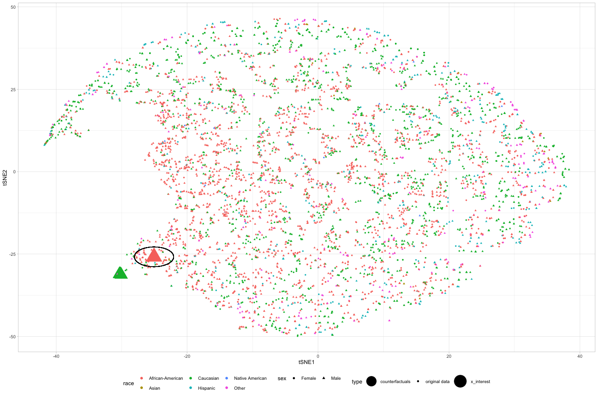

<!-- README.md is generated from README.Rmd. Please edit that file -->

# moccf: Multi-objective counterfactuals for counterfactual fairness

In this example, we train a `randomForest` on the `COMPAS` dataset.

We now examine whether the prediction of a given `yes` for
`two_yr_recid` observation will change to a `no` for the generated
counterfactuals (with `race` changed to `Caucasian` from
`African-American`).

``` r
library(dplyr)
library(plyr)
library(tidyverse)
library(Rtsne)
library(mlr3pipelines)
library(mlr3learners)
options(rgl.useNULL = TRUE)
library(rgl)
library(Rmpfr)
library(checkmate)
library(R6)
library(paradox)
library(data.table)
library(miesmuschel)
library(fairml)
library(counterfactuals)
library(randomForest)
library(iml)
library(ggforce)
library(moccf)
```

First, we load the data and pre-process it

``` r
compas <- fairml::compas
compas <- compas %>% drop_na()
compas <- compas %>% distinct()
```

Then we train the randomForest model to predict the `two-yr-recid` (Two
years recidivism or chances of re-offending). <br> Note that we leave
out one observation from the training data which is our `x_interest`.

``` r
set.seed(142)
rf = randomForest(two_year_recid ~ ., data = compas[-17L, ])
```

We now create an `iml::Predictor` object, that holds the model and the
data for analyzing the model.

``` r
predictor = iml::Predictor$new(rf, type = "prob")
```

Now we set up an object of the `FairnessTest` that uses `MOC` from the
`counterfactuals` package. As the sensitive attribute we use `race`.

``` r
fairness_obj = FairnessTest$new(predictor, df = compas, sensitive_attribute = "race", n_generations = 175)
```

For `x_interest` the model predicts:

``` r
x_interest = compas[17L, ]
predictor$predict(x_interest)
#>     No  Yes
#> 1 0.23 0.77
```

First we generate counterfactuals by running `generate_countefactuals()`
for our `x_interest`. `cfactuals` is the genereted plausible
counterfactuals. While we are examining unfairness for a specific
protected attribute, we keep the other protected attributes fixed.

``` r
cfactuals = fairness_obj$generate_counterfactuals(x_interest, desired_level = "Caucasian", desired_prob = c(0.5,1), fixed_features = "sex")
```

``` r
cfactuals
#>    age juv_fel_count decile_score juv_misd_count juv_other_count v_decile_score priors_count  sex      race c_jail_in c_jail_out c_offense_date screening_date in_custody out_custody
#> 1:  21     0.0000000     9.000000     0.00000000        7.498835       9.000000    1.9203786 Male Caucasian 0.7947562  0.7916205      0.7913651      0.7841957  0.8038687   0.7940901
#> 2:  21     0.0000000     9.000000     0.00000000        7.556387       9.000000    1.0000000 Male Caucasian 0.8084443  0.7916205      0.7913651      0.7914502  0.7940049   0.7940901
#> 3:  21     0.0000000     8.159173     0.00000000        7.405833       9.000000    0.5369950 Male Caucasian 0.7980397  0.7916205      0.7881642      0.7914502  0.8111139   0.7940901
#> 4:  21     0.1248274     9.000000     0.07218905        5.896926       7.678480    1.0000000 Male Caucasian 0.7913651  0.7940100      0.7844286      0.7845970  0.7940049   0.7940901
#> 5:  21     0.0000000     9.000000     0.00000000        7.405833       9.000000    1.0000000 Male Caucasian 0.7913651  0.7916205      0.7913651      0.8048295  0.8490420   0.7940901
#> 6:  21     0.0000000     9.000000     0.42339373        6.269034       9.000000    1.0000000 Male Caucasian 0.8069951  0.7855710      0.7913651      0.7914502  0.8089955   0.7940901
#> 7:  21     0.0000000     9.000000     0.00000000        6.395224       9.000000    1.0000000 Male Caucasian 0.7913651  0.7916205      0.5460581      0.7914502  0.7940049   0.7940901
#> 8:  21     0.1826430     9.000000     0.04233046        5.896926       6.519016    0.1212853 Male Caucasian 0.7999017  0.7916205      0.8119988      0.7914502  0.7940049   0.7940901
#> 9:  21     0.0000000     7.206053     0.00000000        5.896926       6.519016    1.0000000 Male Caucasian 0.7913651  0.7916205      0.7792828      0.7914502  0.7899033   0.7940901
```

We use the `$get_prediction_difference()` method to find differences of
predictions of the `x_interest` and the `cfactuals`.

``` r
pred_diff = fairness_obj$get_prediction_difference(x_interest)
pred_diff
#>    age juv_fel_count decile_score juv_misd_count juv_other_count v_decile_score priors_count  sex      race c_jail_in c_jail_out c_offense_date screening_date in_custody out_custody    No   Yes
#> 1:  21     0.0000000     9.000000     0.00000000        7.498835       9.000000    1.9203786 Male Caucasian 0.7947562  0.7916205      0.7913651      0.7841957  0.8038687   0.7940901 0.312 0.688
#> 2:  21     0.0000000     9.000000     0.00000000        7.556387       9.000000    1.0000000 Male Caucasian 0.8084443  0.7916205      0.7913651      0.7914502  0.7940049   0.7940901 0.378 0.622
#> 3:  21     0.0000000     8.159173     0.00000000        7.405833       9.000000    0.5369950 Male Caucasian 0.7980397  0.7916205      0.7881642      0.7914502  0.8111139   0.7940901 0.414 0.586
#> 4:  21     0.1248274     9.000000     0.07218905        5.896926       7.678480    1.0000000 Male Caucasian 0.7913651  0.7940100      0.7844286      0.7845970  0.7940049   0.7940901 0.338 0.662
#> 5:  21     0.0000000     9.000000     0.00000000        7.405833       9.000000    1.0000000 Male Caucasian 0.7913651  0.7916205      0.7913651      0.8048295  0.8490420   0.7940901 0.418 0.582
#> 6:  21     0.0000000     9.000000     0.42339373        6.269034       9.000000    1.0000000 Male Caucasian 0.8069951  0.7855710      0.7913651      0.7914502  0.8089955   0.7940901 0.394 0.606
#> 7:  21     0.0000000     9.000000     0.00000000        6.395224       9.000000    1.0000000 Male Caucasian 0.7913651  0.7916205      0.5460581      0.7914502  0.7940049   0.7940901 0.384 0.616
#> 8:  21     0.1826430     9.000000     0.04233046        5.896926       6.519016    0.1212853 Male Caucasian 0.7999017  0.7916205      0.8119988      0.7914502  0.7940049   0.7940901 0.460 0.540
#> 9:  21     0.0000000     7.206053     0.00000000        5.896926       6.519016    1.0000000 Male Caucasian 0.7913651  0.7916205      0.7792828      0.7914502  0.7899033   0.7940901 0.534 0.466
#>    diff_from_instance
#> 1:              0.082
#> 2:              0.148
#> 3:              0.184
#> 4:              0.108
#> 5:              0.188
#> 6:              0.164
#> 7:              0.154
#> 8:              0.230
#> 9:              0.304
```

We can also use `$get_mpd()` method to look into the mean of the
prediction differences

``` r
mpd = fairness_obj$get_mpd()
mpd
#> [1] 0.17
```

There are also some other methods for visualization and evaluation. In
order to look into the distribution of the counterfactuals, we can use
the `$plot_tSNE()` method.

``` r
fairness_obj$plot_tSNE(x_interest, factor_variable = "sex")
```

<!-- -->
